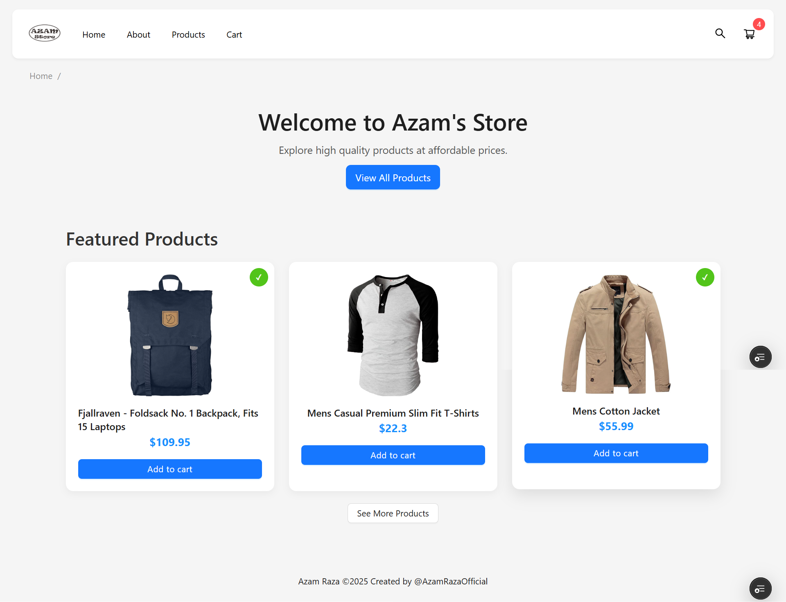
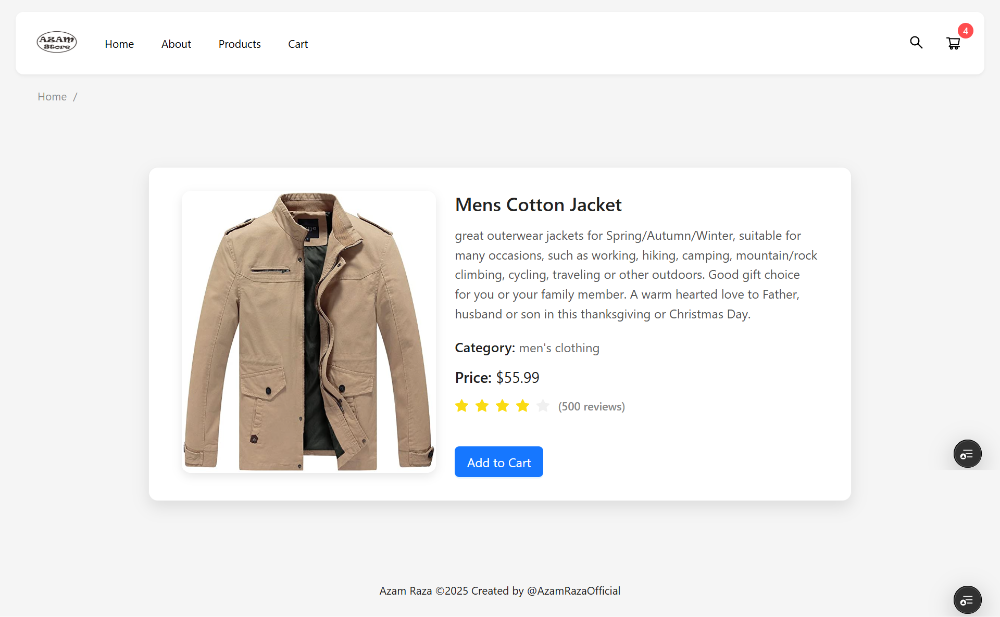
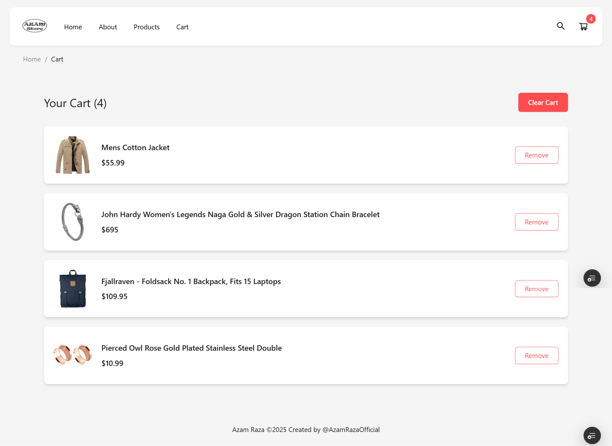
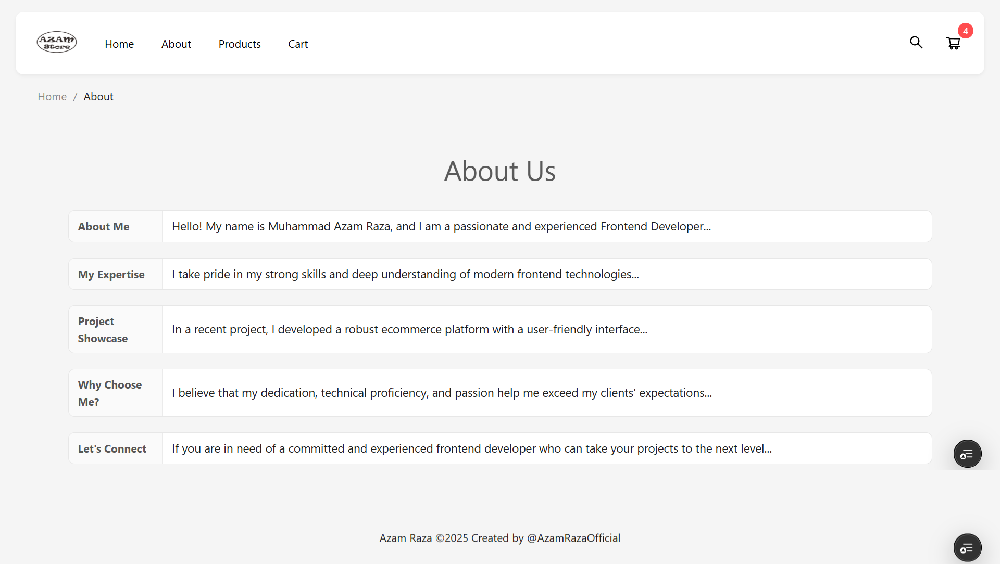

# 🛒 Cart Project (React JS)

A beginner-friendly React JS project that demonstrates a simple **shopping cart** functionality. Users can view products, check details, add items to the cart, delete them from the cart, and explore a simple About page.

---

## 🔗 Live Demo

[👉 Click here to view live demo](https://cart-project-rosy.vercel.app)

---

## 📸 Screenshots

| Home Page | Product Detail | Cart Page | About Page |
|-----------|----------------|-----------|-------------|
|  |  |  |  |

---

## 🚀 Features

- 📦 Product listing page
- 🔍 Product detail view
- ➕ Add to Cart functionality
- ❌ Remove from Cart
- 🧾 Cart summary page
- ℹ️ Simple About page
- ⚛️ Built entirely using React.js (functional components + hooks)

---


## 🧑‍💻 Installation and Running Locally

```bash
# 1. Clone the repository
git clone https://github.com/yourusername/cart-project.git

# 2. Move into the directory
cd cart-project

# 3. Install dependencies
yarn install
# or
npm install

# 4. Run the development server
yarn dev
# or
npm start
